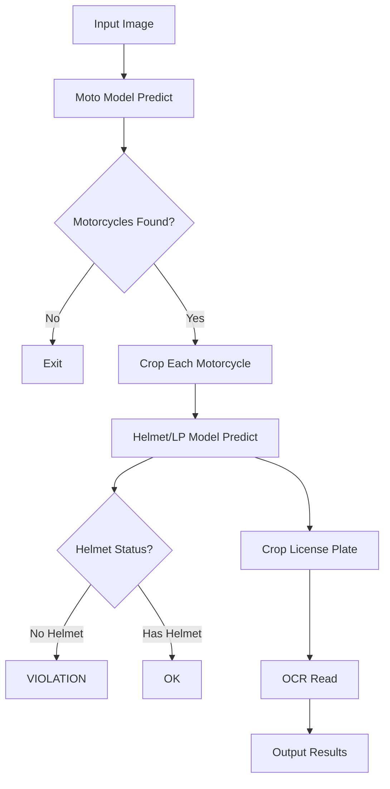

# 📋 KẾ HOẠCH CHI TIẾT - NHÓM 4 NGƯỜI (Tập trung HIỂU SÂU)

> **Mục tiêu**: Hiểu SÂU về dự án, giải thích được mọi thứ, demo tốt cho giáo viên
>
> **Thời gian**: 4 tuần
>
> **Nguyên tắc**: HIỂU SÂU > LÀM NHIỀU

---

## 📌 PHÂN CÔNG VAI TRÒ

| Thành viên         | Vai trò                 | Trách nhiệm chính                                         |
| ------------------ | ----------------------- | --------------------------------------------------------- |
| **Minh Thư ** | **Theory Lead**         | Tìm hiểu LÝ THUYẾT sâu, tạo tài liệu|
| **Mạnh**       | **Dev & Training Lead** | Code, training, optimization, debugging                   |
| **Person C**       | **Data Lead 1**         | Thu thập data, labeling model 1 (Helmet/LP)               |
| **Person D**       | **Data Lead 2**         | Thu thập data, labeling model 2, data quality             |

---

## 🎯 MỤC TIÊU CỤ THỂ

### Person A - Theory Lead

```
✅ Hiểu SÂUUU:
   - YOLO hoạt động như thế nào? (từng layer, từng bước)
   - Transfer Learning là gì?
   - Loss function hoạt động ra sao?
   - OCR pipeline chi tiết
   - VGG16 architecture

✅ Output:
   - Slides thuyết trình (PowerPoint)
   - Tài liệu giải thích bằng tiếng Việt
   - Video demo (nếu cần)
   - Trả lời được mọi câu hỏi của cô giáo
```

### Person B - Dev & Training Lead

```
✅ Hiểu SÂUUU:
   - Source code từng dòng
   - Training process
   - Hyperparameters ảnh hưởng thế nào
   - Debugging và fix bugs

✅ Output:
   - Code chạy mượt, không lỗi
   - Model được train tốt hơn
   - Hiểu được metrics (mAP, precision, recall)
   - Demo live được
```

### Person C & D - Data Leads

```
✅ Hiểu SÂUUU:
   - Dataset structure
   - Labeling best practices
   - Data quality quan trọng thế nào
   - Data augmentation

✅ Output:
   - Dataset chất lượng cao
   - Data analysis report
   - Hiểu ảnh hưởng của data đến model
```

---

## 📅 LỊCH TRÌNH 4 TUẦN

---

# TUẦN 1: HỌC SÂU LÝ THUYẾT + PHÂN TÍCH HIỆN TẠI

## NGÀY 1-2 (Thứ Hai - Thứ Ba): Học lý thuyết CHUYÊN SÂU

### Person A: YOLO Architecture - Học THẬT SÂU

#### Ngày 1: Cơ bản YOLO

```
8:00-10:00: Đọc và HIỂU THẬT KỸ
  □ Paper gốc: "You Only Look Once: Unified, Real-Time Object Detection"
  □ YOLOv8 documentation: https://docs.ultralytics.com/

  GHI CHÚ TỪNG ĐIỂM:
  1. Tại sao gọi là "You Only Look Once"?
     → Vì chỉ cần 1 lần forward pass qua network
     → Khác với R-CNN phải 2000+ forward passes

  2. YOLO chia ảnh thành grid SxS (VD: 13x13)
     → Mỗi cell dự đoán B bounding boxes
     → Mỗi box có: (x, y, w, h, confidence)
     → Mỗi cell dự đoán C class probabilities

  3. Output tensor: S x S x (B*5 + C)
     → VD: 13 x 13 x (3*5 + 80) = 13x13x95

  4. Anchor boxes là gì?
     → Pre-defined boxes với tỷ lệ khác nhau
     → Giúp detect objects với aspect ratio khác nhau

  5. Loss function gồm 3 phần:
     - Box loss: Bounding box coordinates
     - Object loss: Có object hay không
     - Class loss: Object thuộc class nào

  6. NMS (Non-Maximum Suppression):
     - Loại bỏ duplicate boxes
     - Giữ box có confidence cao nhất
     - IoU threshold (thường 0.5)

10:00-12:00: VẼ SƠ ĐỒ và TẠO SLIDES
  □ Vẽ sơ đồ YOLO architecture (dùng Draw.io hoặc PowerPoint)
  □ Tạo slides giải thích từng bước

  Slides nên có:
  - Slide 1: Object Detection là gì?
  - Slide 2: Lịch sử phát triển (R-CNN → Fast R-CNN → YOLO)
  - Slide 3: YOLO overview
  - Slide 4: Grid system
  - Slide 5: Bounding box prediction
  - Slide 6: Loss function
  - Slide 7: NMS
  - Slide 8: YOLOv8 improvements
```

#### Ngày 2: Transfer Learning & Training

```
8:00-10:00: Hiểu TRANSFER LEARNING

  1. Transfer Learning là gì?
     - Train trên dataset lớn (COCO 80 classes, 330K images)
     - Transfer knowledge sang task mới (helmet detection 3 classes)
     - Giữ backbone layers, fine-tune head layers

  2. Tại sao cần Transfer Learning?
     - Dataset nhỏ (vài nghìn ảnh) → không đủ train từ đầu
     - Backbone đã học features cơ bản (edges, shapes, textures)
     - Chỉ cần học task-specific features

  3. Pretrained weights:
     - Weights từ COCO dataset
     - Download từ Ultralytics
     - File .pt chứa toàn bộ model parameters

  4. Fine-tuning vs Training from scratch:
     - Fine-tuning: Freeze backbone, train head → Nhanh, ít data
     - From scratch: Train toàn bộ → Lâu, cần nhiều data

10:00-12:00: Hyperparameters - HIỂU KỸ TỪNG CÁI

  1. Learning Rate (lr):
     - Bước nhảy khi update weights
     - Quá lớn → diverge, không converge
     - Quá nhỏ → train chậm, stuck local minima
     - Best practice: Start 0.01, decay về 0.001

  2. Batch Size:
     - Số images trong 1 batch
     - Lớn: Stable gradients, cần nhiều RAM
     - Nhỏ: Noisy gradients, regularization effect
     - Trade-off: 8, 16, 32 tùy GPU

  3. Epochs:
     - Số lần train qua toàn bộ dataset
     - Ít: Underfit
     - Nhiều: Overfit
     - Dùng early stopping để tự động dừng

  4. Image Size (imgsz):
     - 640x640: Standard, balanced
     - 1280x1280: Better for small objects, slower

  5. Optimizer:
     - SGD: Classic, stable
     - Adam: Adaptive, faster convergence
     - AdamW: Adam + weight decay, best

  6. Data Augmentation:
     - Mosaic: 4 ảnh ghép thành 1
     - Mixup: Blend 2 ảnh
     - Flip, Rotate, Scale
     - HSV: Color jittering

13:00-17:00: TẠO TÀI LIỆU HOÀN CHỈNH
  File: docs/YOLO_Complete_Guide.md

  Nội dung:
  - Giới thiệu Object Detection
  - YOLO Architecture chi tiết
  - Transfer Learning giải thích
  - Hyperparameters và ý nghĩa
  - Training pipeline
  - Evaluation metrics

  + Slides PowerPoint: 20-30 slides
```

---

### Person B: PHÂN TÍCH CODE HIỆN TẠI - THẬT KỸ

#### Ngày 1: Đọc và hiểu SOURCE CODE

````
8:00-12:00: ĐỌCCC CODE KỸ

File 1: Source/main_app.py
□ Đọc từng dòng, comment giải thích

```python
# Line-by-line analysis
import cv2  # Computer Vision library - đọc/xử lý ảnh
import numpy as np  # Numerical computation
from ultralytics import YOLO  # YOLOv8 framework
import easyocr  # OCR library
from pathlib import Path  # File path handling
import shutil  # File operations
import argparse  # Command-line arguments
import torch  # Deep learning framework

# Fix PyTorch 2.6 compatibility
import ultralytics.nn.tasks as tasks
# Patch function để load models với weights_only=False
# Cần thiết vì PyTorch 2.6 mặc định weights_only=True gây lỗi

def initialize_models():
    """
    Initialize 3 models:
    1. Motorcycle detection (Motov10l.pt)
    2. Helmet + LP detection (HelmetLP.pt)
    3. OCR reader (EasyOCR)
    """
    # Chi tiết từng bước...
    pass

def process_image(image_path, moto_model, helmet_lp_model, reader):
    """
    Pipeline xử lý:
    1. Load ảnh
    2. Detect motorcycles → bounding boxes
    3. Crop từng motorcycle
    4. Detect helmet/no-helmet/LP trên crop
    5. Crop license plate
    6. OCR đọc biển số
    7. Logic vi phạm: has_no_helmet = True
    """
    # Phân tích chi tiết từng step...
    pass
````

□ Vẽ flowchart chi tiết
Tool: Draw.io hoặc Mermaid



□ Ghi chú issues và improvements
File: docs/Code_Analysis.md

Issues tìm được:

- PyTorch 2.6 compatibility issue → Đã fix
- Không handle trường hợp nhiều người trên xe
- OCR có thể sai với biển số Việt Nam
- Confidence threshold hardcoded (0.4)

13:00-17:00: CHẠY THỬ VÀ DEBUG

□ Test với nhiều ảnh khác nhau

- Góc cao: 10 ảnh
- Góc ngang: 10 ảnh
- Nhiều người: 10 ảnh
- Điều kiện khó: tối, mưa, xa

□ Ghi nhận kết quả
Excel file: results/Current_Performance.xlsx

Tính accuracy:

- Moto detection: \_\_\_\_%
- Helmet detection: \_\_\_\_%
- LP OCR: \_\_\_\_%

□ Identify bottlenecks

- Phần nào chạy chậm?
- Phần nào sai nhiều?

```

#### Ngày 2: Training Script Analysis
```

8:00-12:00: HIỂU TRAINING PROCESS

□ Tìm hiểu YOLO training

- Ultralytics API
- model.train() parameters
- Callbacks và logging

□ Viết training script mẫu
File: training/train_example.py

```python
from ultralytics import YOLO
import torch

# Check GPU
print(f"CUDA available: {torch.cuda.is_available()}")
print(f"GPU: {torch.cuda.get_device_name(0)}")

# Load model
model = YOLO('yolov8n.pt')

# Train với comments chi tiết
results = model.train(
    # Dataset
    data='data.yaml',  # Path to dataset config

    # Training settings
    epochs=100,  # Số epochs - 1 epoch = 1 lần qua toàn bộ training data
    batch=16,    # Batch size - số images/batch, tùy GPU memory
    imgsz=640,   # Image size - resize inputs về 640x640

    # Optimization
    optimizer='AdamW',  # Optimizer - AdamW tốt nhất cho YOLO
    lr0=0.01,          # Initial learning rate
    lrf=0.01,          # Final learning rate (lr decay)
    momentum=0.937,    # SGD momentum
    weight_decay=0.0005,  # L2 regularization

    # Augmentation
    degrees=15.0,      # Rotate ±15 degrees
    translate=0.1,     # Translate ±10%
    scale=0.5,         # Scale ±50%
    fliplr=0.5,        # Flip left-right 50% probability
    mosaic=1.0,        # Mosaic augmentation

    # Other
    device=0,          # GPU device (0 = first GPU)
    workers=8,         # Dataloader workers
    project='runs/detect',  # Save results location
    name='experiment1',     # Experiment name
    exist_ok=True,     # Overwrite existing
    pretrained=True,   # Use pretrained weights
    verbose=True,      # Print training progress

    # Validation
    val=True,          # Validate during training
    save=True,         # Save checkpoints
    save_period=10,    # Save every 10 epochs

    # Early stopping
    patience=50,       # Stop if no improvement for 50 epochs
)

# Results
print(f"Best mAP50: {results.results_dict['metrics/mAP50(B)']}")
print(f"Best weights: runs/detect/experiment1/weights/best.pt")
```

13:00-17:00: TẠO DOCUMENTATION

□ File: docs/Training_Guide.md
Nội dung:

- Cách setup training
- Giải thích từng parameter
- Best practices
- Common errors và fixes
- Monitoring training (TensorBoard)

```

---

### Person C & D: THU THẬP VÀ PHÂN TÍCH DATA

#### Ngày 1: Phân tích dataset hiện tại

**Person C:**
```

8:00-12:00: PHÂN TÍCH DATASET HIỆN TẠI

□ Viết script đếm và phân tích
File: scripts/analyze_current_dataset.py

```python
from pathlib import Path
from collections import Counter
import matplotlib.pyplot as plt

# 1. Đếm số ảnh
train_dir = Path('data/LP-Helmet.v2i.yolov8/train/images')
val_dir = Path('data/LP-Helmet.v2i.yolov8/valid/images')
test_dir = Path('data/LP-Helmet.v2i.yolov8/test/images')

train_imgs = len(list(train_dir.glob('*.jpg')))
val_imgs = len(list(val_dir.glob('*.jpg')))
test_imgs = len(list(test_dir.glob('*.jpg')))

print("=" * 50)
print("DATASET ANALYSIS")
print("=" * 50)
print(f"\nDataset size:")
print(f"  Train: {train_imgs} images")
print(f"  Valid: {val_imgs} images")
print(f"  Test:  {test_imgs} images")
print(f"  TOTAL: {train_imgs + val_imgs + test_imgs} images")

# 2. Phân tích class distribution
def count_classes(label_dir):
    """Đếm số lượng objects mỗi class"""
    label_dir = Path(label_dir)
    class_counts = Counter()

    for label_file in label_dir.glob('*.txt'):
        with open(label_file, 'r') as f:
            for line in f:
                if line.strip():
                    class_id = int(line.split()[0])
                    class_counts[class_id] += 1

    return class_counts

train_labels = Path('data/LP-Helmet.v2i.yolov8/train/labels')
class_dist = count_classes(train_labels)

print(f"\nClass distribution (training set):")
print(f"  Class 0 (helmet):     {class_dist[0]:,} objects")
print(f"  Class 1 (no-helmet):  {class_dist[1]:,} objects")
print(f"  Class 2 (LP):         {class_dist[2]:,} objects")

# Tính tỷ lệ
total = sum(class_dist.values())
print(f"\nPercentage:")
print(f"  helmet:     {class_dist[0]/total*100:.1f}%")
print(f"  no-helmet:  {class_dist[1]/total*100:.1f}%")
print(f"  LP:         {class_dist[2]/total*100:.1f}%")

# Check imbalance
ratio = class_dist[0] / class_dist[1]
print(f"\nImbalance ratio (helmet:no-helmet) = {ratio:.2f}:1")
if ratio > 2 or ratio < 0.5:
    print("⚠️  WARNING: Dataset is IMBALANCED!")

# 3. Vẽ biểu đồ
plt.figure(figsize=(10, 6))
classes = ['helmet', 'no-helmet', 'LP']
counts = [class_dist[0], class_dist[1], class_dist[2]]
plt.bar(classes, counts, color=['green', 'red', 'blue'])
plt.xlabel('Class')
plt.ylabel('Count')
plt.title('Class Distribution in Training Set')
plt.savefig('analysis/class_distribution.png', dpi=300, bbox_inches='tight')
print(f"\n✅ Saved plot: analysis/class_distribution.png")
```

□ Chạy script

```bash
python scripts/analyze_current_dataset.py
```

□ Tạo báo cáo
File: analysis/Dataset_Analysis_Report.md

Template:

```markdown
# Dataset Analysis Report

Date: \_\_\_
Analyzed by: Person C

## 1. Dataset Size

- Training: \_\_\_ images
- Validation: \_\_\_ images
- Testing: \_\_\_ images
- **Total: \_\_\_ images**

Assessment: ☐ Too small ☐ Adequate ☐ Large

## 2. Class Distribution

| Class     | Count  | Percentage |
| --------- | ------ | ---------- |
| helmet    | \_\_\_ | \_\_\_%    |
| no-helmet | \_\_\_ | \_\_\_%    |
| LP        | \_\_\_ | \_\_\_%    |

**Imbalance Ratio**: \_\_\_:1

Assessment: ☐ Balanced ☐ Slightly imbalanced ☐ Heavily imbalanced

## 3. Issues Identified

- [ ] Dataset too small (< 2000 images)
- [ ] Class imbalance (ratio > 2:1)
- [ ] Missing edge cases (night, rain, etc.)

## 4. Recommendations

1. Need \_\_\_ more images
2. Focus on collecting \_\_\_ class
3. Improve diversity: \_\_\_

## 5. Conclusion

(2-3 câu tóm tắt)
```

13:00-17:00: NGHIÊN CỨU NGUỒN DATA

□ Research datasets online
Roboflow Universe: https://universe.roboflow.com/

- Search: "helmet detection"
- Evaluate top 5 datasets
- Note down links, sizes, quality

□ Tạo list
File: data/Potential_Datasets.md

| Dataset Name | Link | Images | Quality | License | Notes   |
| ------------ | ---- | ------ | ------- | ------- | ------- |
| Dataset 1    | ...  | 2000   | Good    | Public  | Góc cao |
| ...          | ...  | ...    | ...     | ...     | ...     |

```

**Person D:**
```

8:00-12:00: TÌM HIỂU LABELING BEST PRACTICES

□ Đọc tài liệu labeling

- Roboflow blog về labeling
- YOLO labeling guidelines
- Common labeling mistakes

□ Tạo Labeling Guidelines
File: docs/Labeling_Guidelines.md

```markdown
# Labeling Guidelines - PHẢI ĐỌC

## Bounding Box Rules

### ✅ DO (NÊN LÀM)

1. Box phải KHÍT object

   - Không để quá nhiều background
   - Bao gồm toàn bộ object

2. Consistent

   - Cùng object type → cùng size relative

3. Label TẤT CẢ objects
   - Không skip object nhỏ/xa
   - Nhìn thấy được là phải label

### ❌ DON'T (KHÔNG NÊN)

1. Box quá lớn

   - Nhiều background → model học sai

2. Box quá nhỏ

   - Cắt mất phần object

3. Skip objects
   - Làm model confused

## Class Definitions

### helmet

- Người ĐANG ĐỘI mũ bảo hiểm
- Bao gồm:
  ✅ Fullface helmet
  ✅ 3/4 helmet
  ✅ Half helmet
  ✅ Mũ không cài quai (vẫn là helmet!)

### no-helmet

- Người KHÔNG ĐỘI mũ bảo hiểm
- Bao gồm:
  ✅ Đầu trần
  ✅ Mũ lưỡi trai
  ✅ Khăn trùm đầu
  ❌ Mũ trong tay (không đội) → không label

### LP (License Plate)

- Biển số xe rõ ràng
- Tiêu chí:
  ✅ Đọc được ≥70% ký tự
  ✅ Không bị blur quá mức
  ❌ Che khuất >50% → không label

## Edge Cases

1. **Nhiều người trên xe**

   - Label TẤT CẢ đầu người
   - Mỗi đầu 1 box riêng

2. **Object bị che khuất**

   - Che <30%: Label bình thường
   - Che 30-70%: Label nếu chắc chắn
   - Che >70%: Không label

3. **Object nhỏ/xa**

   - Vẫn label nếu nhìn rõ
   - Minimum size: 10x10 pixels

4. **Ảnh mờ/tối**
   - Nhìn không rõ → skip image
   - Không guess
```

13:00-17:00: SETUP LABELING TOOLS

□ Tạo Roboflow account
https://roboflow.com/

□ Tạo project

- Name: "Helmet-Detection-Improved"
- Type: Object Detection
- Classes: helmet, no-helmet, LP

□ Test labeling với 10 ảnh mẫu

- Practice bounding boxes
- Get familiar với interface
- Tính thời gian trung bình: \_\_\_ phút/ảnh

```

---

## NGÀY 3 (Thứ Tư): HỌP NHÓM - CHIA SẺ KIẾN THỨC

### 9:00-12:00: PRESENTATION & KNOWLEDGE SHARING

```

Mỗi người present phần mình học (30-40 phút)

**Person A: YOLO & Transfer Learning**

- Slides PowerPoint
- Giải thích YOLO architecture
- Demo vẽ sơ đồ trên bảng
- Q&A

**Person B: Code & Training**

- Live code walkthrough
- Giải thích flowchart
- Demo chạy code
- Các issues đã tìm ra
- Q&A

**Person C: Dataset Analysis**

- Present báo cáo phân tích
- Show biểu đồ
- Discuss issues
- Recommendations
- Q&A

**Person D: Labeling Guidelines**

- Present guidelines
- Show examples (good vs bad)
- Demo Roboflow
- Q&A

✅ CẢ NHÓM phải hiểu HẾT các phần
✅ Hỏi đến khi hiểu thật sự
✅ Ghi chú lại những gì chưa rõ

```

### 13:00-15:00: THỰC HÀNH CHUNG

```

CẢ NHÓM cùng làm:

1. Chạy code với 20 ảnh test

   - Mỗi người test 5 ảnh
   - Ghi nhận kết quả
   - Thảo luận issues

2. Review current model performance

   - Tính accuracy
   - Identify weaknesses
   - List improvements needed

3. Plan cho tuần tiếp theo

```

### 15:00-17:00: PLANNING & GOALS

```

Xác định mục tiêu cụ thể:

□ Target dataset size: \_\_\_ images

- Current: \_\_\_ images
- Need: \_\_\_ more images

□ Model accuracy goals:

- Current mAP50: \_\_\_%
- Target mAP50: \_\_\_%
- Improvement needed: \_\_\_%

□ Phân công tuần 2:

- Person A: Continue theory (OCR, VGG16)
- Person B: Training experiments
- Person C: Data collection & labeling
- Person D: Data collection & labeling

```

---

# TUẦN 2: HIỂU SÂU HƠN & CẢI THIỆN

## NGÀY 8-10: CHUYÊN MÔN HÓA

### Person A: OCR & VGG16 Deep Dive

```

Mục tiêu: Hiểu SÂUUU OCR và VGG16

NGÀY 8: OCR Pipeline
□ 8:00-12:00: Research OCR

- How OCR works (text detection + recognition)
- EasyOCR architecture
- CRAFT text detector
- CRNN text recognizer
- Alternatives: Tesseract, PaddleOCR, TrOCR

□ 13:00-17:00: Vietnamese License Plate specific

- LP format: XX-YYYYY
- Common OCR mistakes
- Preprocessing techniques
- Test với 50 ảnh LP

NGÀY 9: VGG16 Architecture
□ 8:00-12:00: VGG16 theory

- 16 layers deep
- Convolution layers
- Pooling layers
- Fully connected layers
- Why VGG16 for character recognition?

□ 13:00-17:00: Character recognition

- How VGG16 classifies characters
- Dataset requirements
- Training process
- Compare với modern alternatives

NGÀY 10: Documentation
□ Tạo slides + docs hoàn chỉnh

- OCR Complete Guide
- VGG16 Explained
- Vietnamese LP Recognition

```

### Person B: Training & Optimization

```

Mục tiêu: Train model tốt hơn

NGÀY 8: Baseline Training
□ Train YOLOv8n baseline

- 100 epochs
- Standard settings
- Document results

□ Evaluate và analyze

- mAP50, mAP50-95
- Precision, Recall
- Confusion matrix
- Find errors

NGÀY 9: Improved Training
□ Train YOLOv8m với better params

- Augmentation mạnh hơn
- AdamW optimizer
- 150 epochs
- Learning rate tuning

NGÀY 10: Compare & Document
□ So sánh models
□ Error analysis
□ Write training report
□ Best model selection

```

### Person C & D: Data Collection & Labeling

```

Mục tiêu: Dataset quality cao

NGÀY 8: Download datasets
□ Person C: Roboflow

- Download 2-3 datasets
- Total target: 1000+ images

□ Person D: YouTube frames

- Download traffic videos
- Extract frames
- Filter có xe máy

NGÀY 9-10: Labeling
□ Mỗi người label 200 ảnh

- Follow guidelines strictly
- Person A & B review quality
- Fix issues

□ Total new labels: 400 images

```

---

## NGÀY 11 (Thứ Năm): REVIEW & INTEGRATION

```

9:00-12:00: Merge results
□ Combine datasets
□ Split train/val/test
□ Create data.yaml

13:00-15:00: Test improved model
□ Compare old vs new
□ Document improvements
□ Identify remaining issues

15:00-17:00: Plan tuần 3

```

---

# TUẦN 3: DEEP UNDERSTANDING & REFINEMENT

## Mục tiêu: Hiểu MỌI THỨ, không còn confusion

### Person A: Prepare Teaching Materials
```

- Tạo slides HOÀN CHỈNH cho presentation
- Video explanations (nếu cần)
- FAQ document (answer all possible questions)
- Practice presenting

```

### Person B: Code Optimization
```

- Clean code
- Add comments chi tiết
- Fix all bugs
- Optimize performance
- Create demo script

```

### Person C & D: Final Data Polish
```

- QA all labels
- Fix errors
- Balance dataset
- Create data analysis report

```

---

# TUẦN 4: PRESENTATION & DEMO

## CHUẨN BỊ BÁO CÁO

### Person A: Slides & Theory
```

PowerPoint presentation:

- 40-50 slides
- Clear explanations
- Diagrams và flowcharts
- Results comparison

Topics:

1. Giới thiệu đề tài
2. YOLO architecture
3. Transfer Learning
4. OCR & VGG16
5. Training process
6. Results & Analysis
7. Lessons learned

```

### Person B: Live Demo
```

Prepare:

- Code clean và commented
- Test images diverse
- Video demo backup
- Troubleshooting plan

Demo flow:

1. Show code structure
2. Explain key functions
3. Live detection demo
4. Show results
5. Explain metrics

```

### Person C & D: Data Report
```

Create comprehensive data report:

- Dataset statistics
- Collection process
- Labeling quality metrics
- Challenges faced
- Data impact on model

```

---

## 📝 DELIVERABLES CUỐI CÙNG

```

1. Presentation Slides (Person A)

   - PowerPoint đầy đủ
   - PDF backup

2. Code Repository (Person B)

   - Clean code với comments
   - README.md chi tiết
   - Demo script

3. Dataset (Person C & D)

   - Organized folder structure
   - Data analysis report
   - Labeling guidelines

4. Technical Report (CẢ NHÓM)

   - Architecture explanation
   - Training process
   - Results analysis
   - Improvements made
   - Future work

5. Demo Video (Optional)
   - Screen recording
   - Narration explaining

```

---

## ✅ SUCCESS CRITERIA

### Knowledge (Kiến thức)
```

□ Person A: Giải thích được YOLO, Transfer Learning, OCR, VGG16
□ Person B: Giải thích được code, training process, hyperparameters
□ Person C & D: Giải thích được data importance, labeling quality
□ CẢ NHÓM: Trả lời được mọi câu hỏi của cô giáo

```

### Implementation (Thực hiện)
```

□ Code chạy không lỗi
□ Model train được và có kết quả
□ Dataset quality tốt
□ Demo mượt mà

```

### Presentation (Thuyết trình)
```

□ Slides chuyên nghiệp
□ Giải thích rõ ràng
□ Confident khi present
□ Answer questions well

```

---

## 💡 TIPS QUAN TRỌNG

### Person A (Theory Lead)
```

1. HIỂU THẬT SÂU, đừng học vẹt

   - Vẽ sơ đồ tự tay
   - Giải thích cho người khác
   - Tự đặt câu hỏi và trả lời

2. Slides phải:

   - Clear và concise
   - Visuals > Text
   - Flow logical

3. Practice presenting
   - Nói trước gương
   - Record và review
   - Time management

```

### Person B (Dev Lead)
```

1. Code phải:

   - Clean
   - Commented
   - Working
   - Optimized

2. Understand EVERY LINE

   - Google những gì không hiểu
   - Test từng function
   - Debug thoroughly

3. Demo preparation
   - Test nhiều lần
   - Backup plan
   - Handle errors gracefully

```

### Person C & D (Data Leads)
```

1. Quality > Quantity

   - 500 labels tốt > 2000 labels tệ
   - Consistency is key
   - Follow guidelines strictly

2. Understand data impact

   - Bad data = bad model
   - Diversity matters
   - Balance is important

3. Document everything
   - Where data from
   - How labeled
   - Quality metrics

```

---

## 🚀 BẮT ĐẦU NGAY

### Tuần này (Tuần 1):
```

□ Ngày 1-2: Learn theory deeply
□ Ngày 3: Share knowledge
□ Ngày 4-5: Start data work

```

### Checklist Ngày 1:
```

□ Person A: Read YOLO paper + docs (4h)
□ Person B: Analyze main_app.py (4h)
□ Person C: Run dataset analysis script
□ Person D: Create labeling guidelines
□ Evening: Share progress in group chat

```

---

**YÊU CẦU CỐT LÕI:**
- HIỂU SÂU > Làm nhiều
- QUALITY > Quantity
- EXPLAIN được mọi thứ cho cô giáo
- DEMO được thành công

**NHẮC NHỞ:**
- Họp nhóm 2 lần/tuần: Thứ 4 & Chủ nhật
- Daily progress update
- Help each other
- Ask when confused
- Document everything

Good luck team! 💪🚀
```
