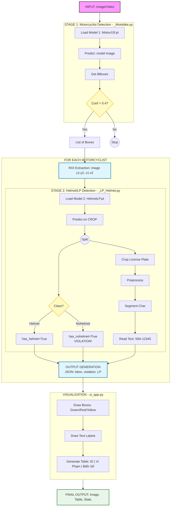

```mermaid
graph TD
%% Nodes styling
classDef input fill:#f9f,stroke:#333,stroke-width:2px;
classDef process fill:#e1f5fe,stroke:#0277bd,stroke-width:2px;
classDef decision fill:#fff9c4,stroke:#fbc02d,stroke-width:2px;
classDef output fill:#e8f5e9,stroke:#2e7d32,stroke-width:2px;

    Input[INPUT: Image/Video]:::input --> Stage1

    subgraph Stage1 [STAGE 1: Motorcyclist Detection - _Motobike.py]
        direction TB
        S1_Load[Load Model 1: Motov10l.pt]
        S1_Pred[Predict: model image]
        S1_Bbox[Get BBoxes]
        S1_Filter{Conf > 0.4?}:::decision

        S1_Load --> S1_Pred --> S1_Bbox --> S1_Filter
    end

    S1_Filter -- Yes --> LoopStart[List of Boxes]
    S1_Filter -- No --> EndNode((Stop))

    subgraph Loop [FOR EACH MOTORCYCLIST]
        direction TB
        Crop[ROI Extraction: image y1:y2, x1:x2]:::process

        subgraph Stage2 [STAGE 2: Helmet/LP Detection - _LP_Helmet.py]
            direction TB
            S2_Load[Load Model 2: HelmetLP.pt]
            S2_Pred[Predict on CROP]

            Split((Split))

            %% Branch Helmet
            CheckHelmet{Class?}:::decision
            ResHelmet[has_helmet=True]
            ResNoHelmet["has_nohelmet=True <br/> VIOLATION!"]

            %% Branch LP
            CropLP[Crop License Plate]
            OCR_Pre[Preprocess]
            OCR_Seg[Segment Char]
            OCR_Read[Read Text: 59A-12345]

            S2_Load --> S2_Pred --> Split
            Split --> CheckHelmet
            CheckHelmet -- Helmet --> ResHelmet
            CheckHelmet -- NoHelmet --> ResNoHelmet

            Split --> CropLP --> OCR_Pre --> OCR_Seg --> OCR_Read
        end

        GenOut[OUTPUT GENERATION <br/> JSON: bbox, violation, LP]:::process
    end

    LoopStart --> Crop --> Stage2
    ResHelmet --> GenOut
    ResNoHelmet --> GenOut
    OCR_Read --> GenOut

    GenOut --> Vis

    subgraph Vis [VISUALIZATION - ui_app.py]
        direction TB
        Draw[Draw Boxes: Green/Red/Yellow]
        Label[Draw Text Labels]
        Table["Generate Table: ID | Vi Phạm | Biển Số"]

        Draw --> Label --> Table
    end

    Vis --> Final[FINAL OUTPUT: Image, Table, Stats]:::output
```
